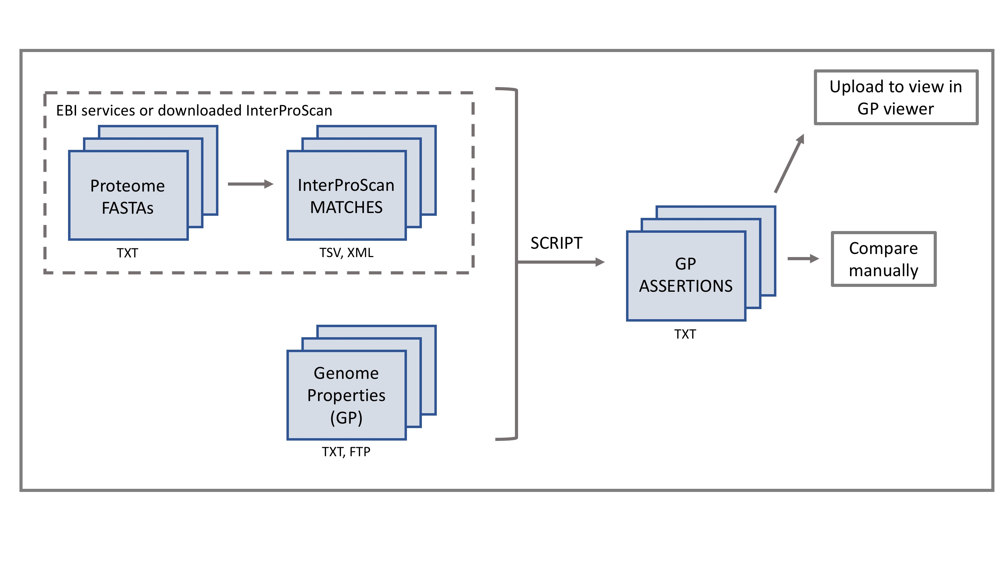

Calculating Genome Properties
=============================

The presence or absence of genome properties (GPs) within a given genome or proteome, is calculated based on the matches to the relevant InterPro entries and their associated protein signatures. The evidence (HMM) for each constituent step is tested against the genome in question, and each step defined as a hit or a miss. The total number of hits is then compared with the threshold level defined for the GP, to determine if the GP resolves to a YES (all required steps are present), NO (no required steps are present) or PARTIAL (the number of required steps present is greater than the threshold, indicating that some evidence of the presence of the GP can be assumed).

The pipeline for how users can calculate GPs for there own data is shown in the figure below.

|calc|

Users begin with their own query "genome/proteome" in the form of a list of FASTA format sequences. The InterProScan matches for this genome must then be calcualted. This can either be done using EBI webservices, or by downloading a local install of InterProScan and running the calculation locally. By either method, the InterProScan matches are output in either a TSV or XML format. A script then perfoms the calculation of the GPs based on the InterProScan matches, resulting in a text file list of the assertions for each GP. This list can be viewed and compared maually to other available data, but a more user friendly method of assessment is to upload this file to the GP viewer available on this website. This allows the user to easily compare the pattern of assertions for the user-defined genome, with the set of reference genomes provided on the webiste. For more information on how to use the viewer, see here #viewer .
