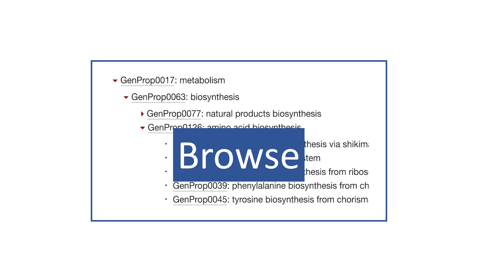

Genome properties is an annotation system whereby functional attributes can be assigned to a genome, based on the presence of a defined set of protein signatures within that genome. Properties (which often describe pathways) are composed of steps, with each step defining a protein required for the function of the pathway/property. Genome properties use protein signatures as evidence to determine the presence of each step within a property.

+-----------+----------+
| |browse|  | |viewer| |
+-----------+----------+

Users can browse the genome properties, which are arranged within a hierarchy, examining the specific steps defined within each property. Alternatively, the properties can be compared in terms of the species they are found/not found in, across a modifiable set of genomes using our interactive viewer.

.. include:: ../flatfiles/version.txt
