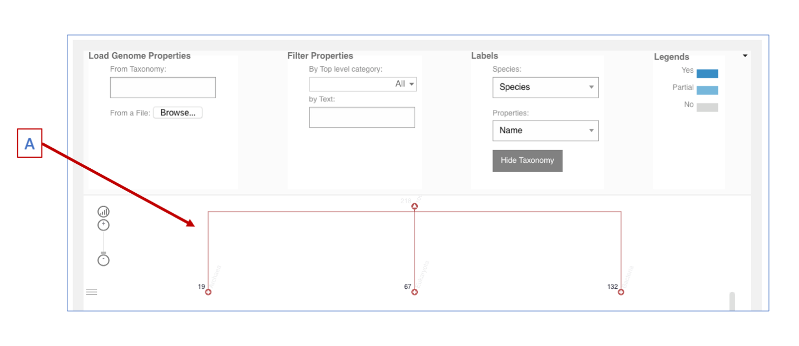
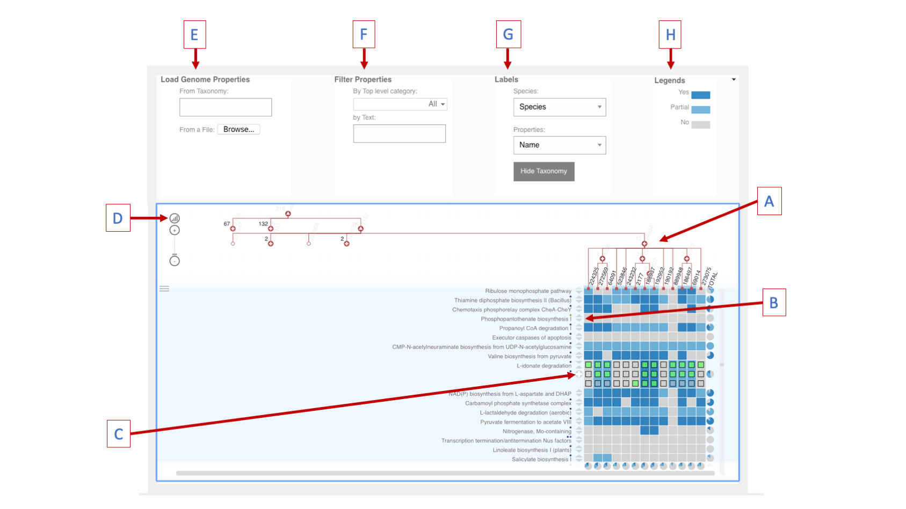

How to use the Genome Properties Viewer
=======================================

When you open the viewer page, you may see a temporary loading page initially. This should clear in a few seconds to display the loaded viewer ready to use.

|fig1|

The taxonomic tree **(A)** is displayed in red below the search options at the top of the page. By default the root node will be open showing the first level of taxonomic classification, Archea, Eukaryota, and Bacteria. The numbers next to each node name indicate the number of species within that node. To drill down further into the tree, you can single click on the white 'plus' sign on any node to open up the next level of classification within that node. To close the node again, click on the white 'triangle' shown within the open node.

|fig2|

When you have selected a particular node or species that you are interested in, you can load the pre-calculated Genome Properties results for those species by double clicking on the node of interest. The data is loaded as a matrix, where each column represents a species, and each row represents a Genome Property. The colours indicate the result for that property in that species: dark blue - YES, light blue - PARTIAL, grey - NO. To see the individual step results, click on the double arrow after the property name on the left of the matrix **(B)**. To see this in more detail (including the step names) click on the white 'plus' symbol that appears next to the expanded step matrix **(C)**. Within the step results, the green boxes denote a step-match has been found.

The individual species nodes can be manually rearranged within the tree by clicking and dragging. Additionally there are a selection of automatic ordering options available by clicking on the icon above the zoom controls at the top left of matrix window **(D)**.

Above the tree are various options to add to, or filter data included in the matrix. 

* **Load Genome Properties** - **(E)** Rather than navigate through the tree, you can search for the name or taxonomic identifier of any species you would like to load data for, using the search box shown. The list of species available can be found under the *Species* tab or `here <https://github.com/ebi-pf-team/genome-properties/blob/master/flatfiles/proteome_list.csv>`_. You are also able to uplaod data for a novel genome/proteome/species using the 'Browse' button. To utilise this functionality, you must first analyse the FASTA files containined in your novel species using InterProScan. The tsv output provided by InterProScan can then be uploaded to the Genome Properties viewer for comparison with representative spcies. For more information on using InterProScan see `here <https://www.ebi.ac.uk/interpro/interproscan.html>`_.

* **Filter Properties** - **(F)** You can filter the selection of Genome Properties included in the viewer by either selecting only those top level category terms you are interested in from the drop-down, or by typing a word to filter on the property names (for example by typing the word "secretion"). By default, all categories are already pre-selected in the drop-down, therefore you must first click 'none' to deselect all categories, and then select those you would like to include in your matrix.

* **Labels** - **(G)** When a large number of species are included in the matrix, it can be difficult to see the tree structure and the full species labels, therefore a number of options are provided for visualisation purposes. Choosing to view only the tax ID, means the labels are much shorter. Additionally, when you have loaded all the species you are interested in and have the tree ordered in a way that suits your needs, you can use the 'Hide Taxonomy' button to remove the tree structure and leave only the labels.

* **Legends** - **(H)** Hovering over the colour panels shown at the top right, you will see a pop-up that describes the various options you have to filter the data based on Genome Properties results. Clicking on each colour panel will cycle through the options for that colour, e.g. show only properties with all YES results, show only properties that have at least one YES result, show only properties that have zero YES results, etc. 
